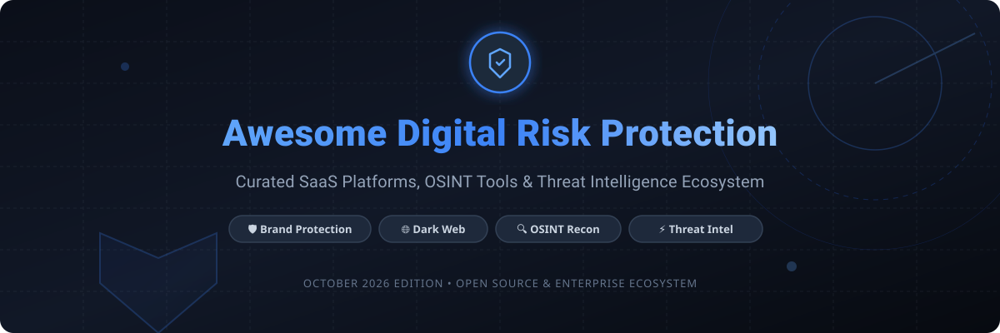

  
  
  
  
  
  
  

  

# 🛡️ Awesome Digital Risk Protection (DRP) & Threat Intelligence Ecosystem

> 🚀 **Curated List of SaaS Platforms & Open-Source GitHub Projects**  
> *Focused on Brand Protection, Dark Web Monitoring, Executive Digital Risk, Phishing Domain Detection & External Threat Intelligence (CTI)*

📅 **Last updated: October 2026**

---

## 💡 Overview & Market Landscape

Digital Risk Protection (DRP) solutions actively monitor the open, deep, and dark web for brand abuse, leaked credentials, executive impersonation, phishing domains, and exposed digital assets.

### 📊 Sector Market Size & Dynamics
* **Estimated Market Size**: The global Digital Risk Protection Services (DRPS) market is valued at approximately **$3.5 Billion (2026)** and is projected to expand at a CAGR of **~16.5%**, approaching **$7.5+ Billion by 2032**.
* **Market Fragmentation & Structure**: The sector is **moderately fragmented** but rapidly consolidating around major cybersecurity conglomerates (e.g., Google acquiring Mandiant, Mastercard acquiring Recorded Future). While enterprise CTI & DRP market leaders dominate closed-source dark web scraping and global automated takedown networks, open-source projects provide essential building blocks for domain typosquatting detection, Certificate Transparency log parsing, and local OSINT reconnaissance.

---

## 📑 Table of Contents
- [🏢 Enterprise SaaS & Hosted Platforms](#-enterprise-saas--hosted-platforms)
- [🔓 Open-Source GitHub Projects](#-open-source-github-projects)
- [🛠️ Composable Stacks & Architecture](#-composable-stacks--architecture)
- [🤝 How to Contribute](#-how-to-contribute)
- [💖 Support & Sponsorship](#-support--sponsorship)
- [⚖️ Disclaimer & Compliance](#%EF%B8%8F-disclaimer--compliance)
- [📈 Star History](#-star-history)

---

## 🏢 Enterprise SaaS & Hosted Platforms

Below is a comparative breakdown of leading commercial Digital Risk Protection and Threat Intelligence platforms, **sorted in descending order by company size (Revenue / Market Valuation)**:

| 🏢 Vendor / Platform | 💼 Description & Focus | 💰 Starting Tier Pricing | 🆓 Free Tier / Free Trial Limits | 📈 Company Size (Revenue / Valuation) |
| :--- | :--- | :--- | :--- | :--- |
| **[Mandiant Advantage](https://www.mandiant.com/)** | Threat intelligence, external attack surface management (EASM), and digital risk analytics. | Starts at $10,000/year for basic CTI / Validation module. | Free Tier available (Mandiant Advantage Free Edition with basic feeds). | **~$483M+ Annual Revenue** (Acquired by Google for $5.4B) |
| **[Recorded Future](https://www.recordedfuture.com/)** | Enterprise cyber threat intelligence (CTI), threat graph analytics, and digital risk protection. | Starts at ~$45,000 – $50,000/year for Core subscriptions via AWS Marketplace. | No free tier; custom interactive demo & sample intel report on request. | **~$300M+ ARR** (Acquired by Mastercard for $2.65B) |
| **[ZeroFox](https://www.zerofox.com/)** | Broad digital risk protection platform covering brand security, social media threat monitoring, and takedowns. | Starts at ~$15,000 – $30,000/year for entry-level Foundation Bundle. | No public free tier; 14-day trial available via sales POC request. | **~$255M Annual Revenue** (Acquired / Formerly NASDAQ: ZFOX) |
| **[Flashpoint](https://flashpoint.io/)** | Deep & dark web threat intelligence, breach database monitoring, and physical security risk alerts. | Starts at ~$25,000 – $35,000/year base subscription (quote-based). | No public free tier; 14-day enterprise evaluation trial upon request. | **~$100M+ Annual Revenue** (Acquired by Audax Private Equity) |
| **[Cyble](https://cyble.com/)** | AI-powered dark web monitoring, threat intelligence platform, and executive digital risk protection. | Starts at ~$12,000/year base tier via AWS Marketplace private offer. | Free trial available (7-day evaluation upon account verification). | **~$52M Estimated Annual Revenue** (Private venture-backed) |
| **[SOCRadar](https://socradar.io/)** | Extended Threat Intelligence (XTI) specialist with dark web & credential breach monitoring. | Starts at ~$3,000 – $6,000/year for Business Tier. | **Free Tier** (1-year access to CTI tools) & 7-day Business Tier trial. | **~$25M Estimated Annual Revenue** ($30M+ total funding) |
| **[Digital Shadows (ReliaQuest)](https://www.reliaquest.com/)** | SearchLight digital risk monitoring and threat exposure analytics engine. | Starts at ~$20,000 – $30,000/year subscription. | No free tier; 7-day evaluation trial upon request. | **~$25M Estimated Revenue** (Acquired by ReliaQuest for $160M) |
| **[Proofpoint DRP](https://www.proofpoint.com/)** | Brand protection, lookalike domain monitoring, and social media digital risk management. | Starts at ~$12,000 – $18,000/year module add-on. | No free tier; 30-day proof-of-concept trial via sales team. | **~$20M Estimated Module Revenue** (Proofpoint Parent ~$1B+) |
| **[Rapid7 Threat Command (IntSights)](https://www.rapid7.com/)** | External threat intelligence & DRP module fully integrated with SecOps workflows. | Starts at ~$15,000 – $25,000/year (AWS Marketplace private offer). | No public free tier; 14-day guided trial / POC upon request. | **~$20M Estimated Module Revenue** (Acquired for $335M) |
| **[CybelAngel](https://cybelangel.com/)** | External risk protection, exposed cloud asset discovery, and data leak detection. | Starts at ~$15,000 – $25,000/year subscription. | No free tier; 14-day complimentary exposure assessment on request. | **~$18M Estimated Annual Revenue** (Private venture-backed) |
| **[Group-IB](https://www.group-ib.com/)** | Digital Risk Protection, online fraud prevention, and external threat intelligence. | Starts at ~$15,000 – $20,000/year for DRP module. | No public free tier; 14-day interactive demo / trial on request. | **~$15M Estimated Annual Revenue** (Private global HQ Singapore) |
| **[Flare](https://flare.io/)** | Threat exposure management, dark web paste monitoring, and credential leak discovery. | Starts at ~$12,000/year base subscription. | **14-day full feature free trial** with corporate email verification. | **~$13M Estimated Annual Revenue** (Private venture-backed) |
| **[Constella Intelligence](https://constellaintelligence.com/)** | Executive protection and identity breach intelligence across open and dark web sources. | Starts at ~$10,000 – $15,000/year for identity exposure monitoring. | No free tier; 14-day enterprise trial / sample exposure report. | **~$12M Estimated Annual Revenue** (Private equity backed) |
| **[DarkOwl](https://www.darkowl.com/)** | Dark web web-crawling database and threat intelligence API suite. | Starts at ~$5,000 – $10,000/year for basic DarkOwl Vision API access. | No free tier; 14-day free trial of DarkOwl Vision for verified domains. | **~$8M Estimated Annual Revenue** (Private specialized vendor) |

---

## 🔓 Open-Source GitHub Projects

Below are top open-source repositories for building custom DRP, OSINT, and domain monitoring pipelines, **sorted in descending order by GitHub Stars_Count**:

| 📦 Repository / Tool | 🌟 GitHub_Stars | 🔍 Category & Description |
| :--- | :--- | :--- |
| **[sherlock-project/sherlock](https://github.com/sherlock-project/sherlock)** |  | **OSINT & Username Recon**: Hunt down social media accounts across 400+ networks to spot executive impersonation and fake brand profiles. |
| **[smicallef/spiderfoot](https://github.com/smicallef/spiderfoot)** |  | **OSINT Automation**: Hundreds of automated modules for domain, IP, leak, email, and external footprint reconnaissance. |
| **[laramies/theHarvester](https://github.com/laramies/theHarvester)** |  | **Footprint Expansion**: Essential OSINT tool for gathering emails, subdomains, hosts, employee names, and open ports. |
| **[OWASP/Amass](https://github.com/OWASP/Amass)** |  | **Attack Surface Mapping**: In-depth network mapping and external asset discovery using open-source data collection & active recon. |
| **[projectdiscovery/subfinder](https://github.com/projectdiscovery/subfinder)** |  | **Subdomain Discovery**: High-speed passive subdomain enumeration tool that extracts subdomains from public intelligence sources. |
| **[elceef/dnstwist](https://github.com/elceef/dnstwist)** |  | **Typosquatting Engine**: Classic domain permutation generator detecting lookalike domains, homoglyphs, and brand impersonation. |
| **[x0rz/phishing_catcher](https://github.com/x0rz/phishing_catcher)** |  | **CT Log Monitor**: Real-time Certificate Transparency stream consumer catching suspicious SSL certificate issuances matching brand keywords. |
| **[ail-project/ail-framework](https://github.com/ail-project/ail-framework)** |  | **Data Leak Triage**: Open Analysis Information Leak framework to crawl, parse, and analyze pastes, leaks, and dark web data. |
| **[openbpl/openbpl](https://github.com/openbpl/openbpl)** |  | **Brand Protection Toolkit**: Open-source framework designed for monitoring Certificate Transparency logs for lookalike brand domains. |

---

## 🛠️ Composable Stacks & Architecture

Security operations and CTI teams frequently combine open-source tools with commercial feeds to construct modular, cost-effective Digital Risk Protection stacks:

1. **Domain & Impersonation Monitoring Pipeline**:
   `CT Log Monitors (phishing_catcher / OpenBPL)` ➡️ `dnstwist (permutation checking)` ➡️ `Automated Screenshotter & DNS Resolver` ➡️ `SOAR / Slack Alert`

2. **External Attack Surface Reconnaissance Stack**:
   `Amass + Subfinder` ➡️ `SpiderFoot (automated enrichment)` ➡️ `SIEM / DefectDojo`

3. **Leak & Paste Intelligence Workflow**:
   `AIL Framework (pastebin & leak parsing)` ➡️ `Credential Exposure Matcher` ➡️ `Incident Response Queue`

---

## 🤝 How to Contribute

We welcome contributions from the global cybersecurity community!

1. 🍴 **Fork the repository**.
2. 📝 **Add or update entries** in `README.md` maintaining table formatting.
3. 📌 **Include essential details**: Platform/Tool Name, Link, Description, Pricing/Stars, and Category.
4. 🚀 **Submit a Pull Request** with a clear explanation of your addition.

⭐ **Don't forget to star this repository if you find it helpful!**

---

## 💖 Support & Sponsorship

If you find this repository valuable for your threat intelligence research or cybersecurity operations, please consider supporting the project:

- ⭐ **Star this repository** to help others discover it.
- 🔀 **Fork and share** it with your security team and community.
- ☕ **Buy me a coffee / Sponsor**: If you'd like to support ongoing updates and maintenance, consider sponsoring via [GitHub Sponsors Dashboard](https://github.com/sponsors/ishandutta2007).

Thank you for your support! 🙌

---

## ⚖️ Disclaimer & Compliance

* ℹ️ This repository is a **community-curated index** provided for educational and security research purposes only.
* 🛡️ Always ensure proper authorization before scanning or monitoring infrastructure. Scraping certain dark-web forums or repositories may violate terms of service or local laws.
* ⚖️ Coordinate takedowns through official legal representatives, domain registrars, and hosting providers.

---

## 📈 Star History

---

  <b>Built for Threat Intelligence Analysts, Brand Protection Leads, and SOC Teams worldwide.</b>

